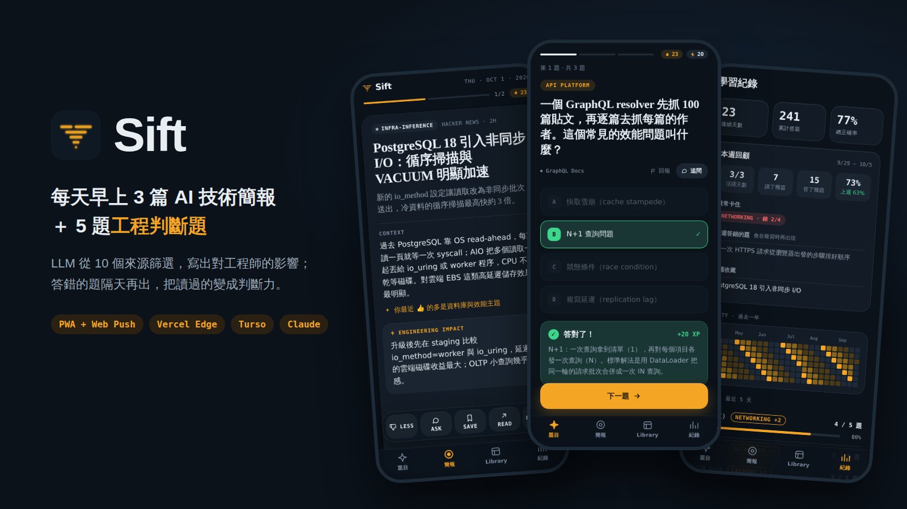
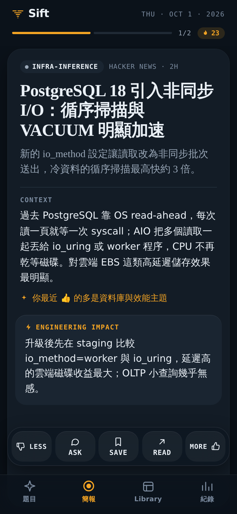
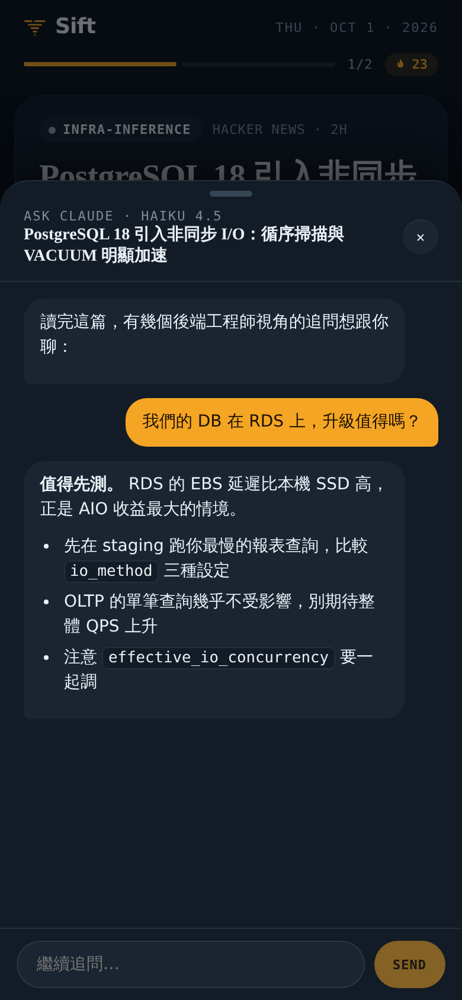
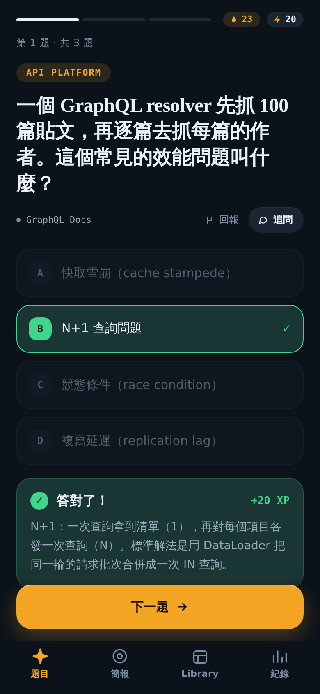
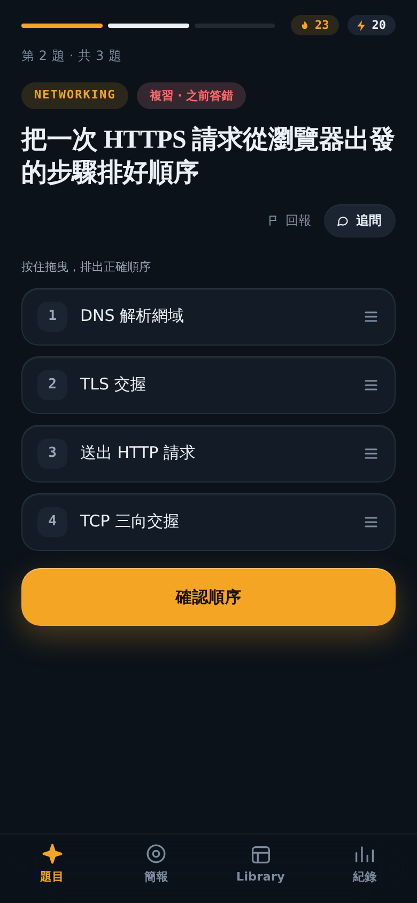
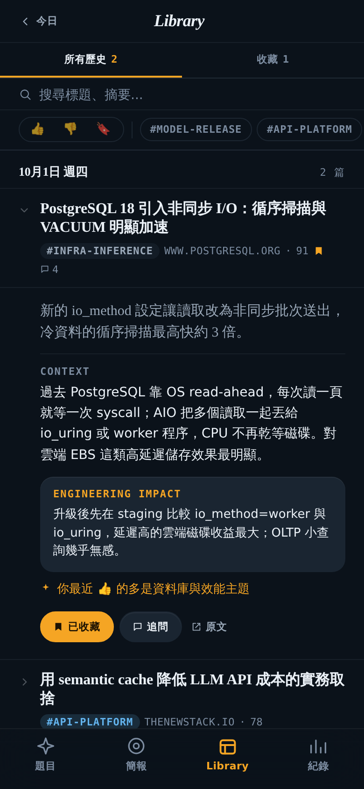
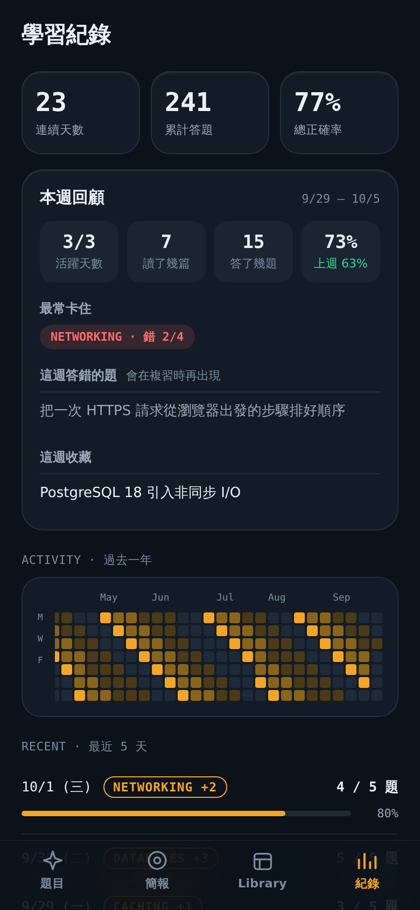
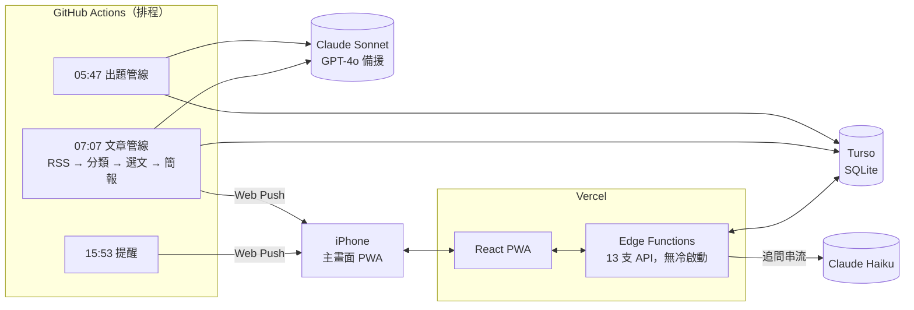

  

<h1 align="center">Sift</h1>

  <b>每天早上，把 AI 新聞篩成 3 篇工程師真正該讀的，再用 5 題判斷題把它變成自己的東西。</b> 
  一個人從零做到上線、每天自動運行的全端作品：LLM 資料管線 × 間隔複習 × iOS PWA 推播。

  <a href="https://ai-morning-brief-chi.vercel.app"><b>Live Demo</b></a> ·
  <a href="./docs/ARCHITECTURE.md">Architecture</a> ·
  <a href="./docs/FRONTEND_FIX_LOG.md">iOS PWA 踩坑紀錄</a>

---

## 為什麼做這個

AI 新聞量很大，但大部分跟「我明天寫 code 的決定」無關，讀過的東西也很快就忘。Sift 每天做兩件事：

1. **篩**：從 10 個來源（OpenAI、Google DeepMind、Cloudflare、AWS ML 等官方部落格，加上 Hacker News、Simon Willison 等技術社群）抓新文章，讓 LLM 逐篇判斷對後端／infra 工程師有沒有用。只留最多 3 篇，每篇寫出「對工程的影響」。寧可少給，也不拿湊數的文章充版面。
2. **練**：每天出 5 題 backend / infra 判斷題，有單選、排序、配對、填空四種題型。答錯的題會在 1 → 3 → 7 天後重出，連對三次才算學會。

---

## 一天的流程

| 時間（台北） | 發生什麼 |
|---|---|
| 05:47 | 出題管線生成 5 題新題目，避開近期出過的、被使用者回報過的題型 |
| 07:07 | 文章管線抓 RSS，LLM 分類 → 選文 → 寫簡報 → 存 DB → **推播到 iPhone 鎖定畫面** |
| 早上 | 點通知直接進簡報（推播時 Service Worker 已預先抓好內容，打開不用等）→ 滑卡 👍👎 → 讀完一鍵去答題 |
| 15:53 | 今天還沒讀也沒答題的裝置，才會收到一則提醒，文案帶著連續天數 |

---

## 畫面

> 截圖為示範資料，介面與互動為實際產品。

<table>
  <tr>
    <td align="center" width="33%"> <b>簡報</b> 一次一張卡，LLM 寫的 Context 與 Engineering Impact；左右滑 = 👎 / 👍，回饋會影響明天的選文</td>
    <td align="center" width="33%"> <b>追問</b> 對任何一篇或任何一題直接問 Claude，串流回答，對話歷史會保存</td>
    <td align="center" width="33%"> <b>判斷題</b> 答完立刻給解說與 XP；答題前追問不會被爆雷</td>
  </tr>
  <tr>
    <td align="center"> <b>拖曳排序 + 複習</b> 之前答錯的題會帶「複習」標籤回來</td>
    <td align="center"> <b>Library</b> 所有讀過的文章，可搜尋、篩選、收藏（同步 Notion）</td>
    <td align="center"> <b>學習紀錄</b> 連續天數、本週回顧（最常卡住的分類、這週答錯的題）、一年熱力圖</td>
  </tr>
</table>

---

## 架構

- **兩條管線完全解耦**：出題不依賴文章。排程、入口、去重邏輯都各自獨立，只共用 LLM provider 的選擇邏輯和同一顆 DB，所以任一條掛掉都不拖累另一條，也能各自重跑。
- **API 全部是 Edge Functions**：13 支 API 都跑在 Vercel Edge，直接用 HTTP 打 Turso，沒有 Node 冷啟動。完整 API contract 與 DB schema 見 [docs/ARCHITECTURE.md](./docs/ARCHITECTURE.md)。

---

## 工程上值得一提的地方

### 1. 回饋迴路，不是一次性腳本
Classifier 選文前會讀近 30 天的 👍👎，當作偏好 context。
- **防噪音**：累積到 10 筆才開始注入；某個分類要被 👎 兩次以上，才算負訊號。
- **保 cache**：偏好接在 system prompt 的**尾端**。前面穩定的部分維持 Anthropic prompt cache 命中，變動的偏好不會讓整段 cache 失效。

### 2. 失敗要大聲，不要假裝沒事
- **執行順序**：推播一定排在 DB 寫入成功之後。否則可能發生「通知到了，點開卻沒內容」。
- **LLM 失敗**：主力 LLM 整批失敗時（例如額度用完、全部 429），自動切到備援。兩家都失敗就讓 workflow 紅燈。這是踩坑後補的：之前全部失敗會被當成「沒有值得讀的文章」，結果送出一則假的「今日無重大 AI 新聞」。
- **排程延遲**：GitHub cron 偶爾會晚好幾個小時才跑，所以管線做成每日冪等，手動重跑不會重複推播。
- **沒人用就不花錢**：連續 3 天沒有打開 App、滑卡或答題，就不生成簡報、不推播；題目則看庫存，每個活躍使用者都還有 10 題以上沒答，就不出新題。下午提醒不呼叫 LLM 所以照發，它負責把人叫回來。

### 3. 間隔複習完全由作答紀錄推算
「哪些題該重出」不另開一張表，而是每次從 `quiz_attempts` 即時推算：
- 規則：最後一次答錯後，連對 0 / 1 / 2 次，分別在 1 / 3 / 7 天後重出；連對 3 次就畢業。
- 好處：沒有排程狀態需要同步，也不會跟作答紀錄不一致。

### 4. iOS 主畫面 PWA 的細節
iOS standalone PWA 有很多非標準行為，踩過的坑都記在 [FRONTEND_FIX_LOG](./docs/FRONTEND_FIX_LOG.md)，目前 28 則。例如：
- **底部對齊**：safe-area 與 home indicator 的對齊。
- **鍵盤**：鍵盤彈出時，追問視窗要貼齊 `visualViewport`。
- **防誤觸**：底部導覽列要和「滑回主畫面」手勢區隔開。

### 5. 開 App 要快
目標是打開就有內容，不等網路：
- **今天打開過**：直接用 localStorage 快取顯示。
- **從推播點進來**：Service Worker 收到推播時已經把當天簡報抓進 Cache Storage。
- **都沒有的話**：`index.html` 不等 JS 載完就先發出 API 請求。
- **其他頁面**：程式碼分割加閒置時預載。

在 4 倍 CPU 降速下實測：從 ~1.1 秒降到 ~0.6 秒。

---

## 成本

全系統每年約 **US$45**。下表依實際 Actions log 的 token 用量估算；prompt caching 已啟用。

| 元件 | 模型 | 每天 | 年費 |
|---|---|---|---|
| 文章分類 | Claude Sonnet 4.6 | 24 篇各 1 次（共用 cached system prompt） | ~$36 |
| 簡報生成 | Claude Sonnet 4.6 | 1 次 | ~$4 |
| 出題 | Claude Sonnet 4.6 | 1 次，5 題 | ~$4 |
| 追問 | Claude Haiku 4.5 | 依使用量 | ~$1 |
| Vercel / Turso / GitHub Actions | — | — | $0（免費額度） |

---

## Tech Stack

| | |
|---|---|
| 前端 | React + Vite（PWA，手寫 Service Worker，無 vite-plugin-pwa）、iOS standalone Web Push（VAPID） |
| API | Vercel Edge Functions（raw fetch，無框架） |
| 資料 | Turso（libSQL / SQLite），Drizzle（管線端） |
| 排程 | GitHub Actions cron |
| LLM | Claude Sonnet 4.6 主力、GPT-4o 備援、Claude Haiku 4.5 追問 |
| 其他 | Notion API（收藏同步）、React Native / Expo（原生 app 版本，暫時擱置） |

---

## 文件

| 文件 | 內容 |
|---|---|
| [docs/ARCHITECTURE.md](./docs/ARCHITECTURE.md) | 分類規則、選文演算法、出題驗證、完整 DB schema 與 API contract |
| [docs/DEPLOY.md](./docs/DEPLOY.md) | 本地開發、部署、環境變數 |
| [docs/FRONTEND_FIX_LOG.md](./docs/FRONTEND_FIX_LOG.md) | Web / iOS PWA 修復史 |
| [docs/KNOWN_ISSUES.md](./docs/KNOWN_ISSUES.md) | 目前已知的問題 |
| [docs/PRINCIPLES.md](./docs/PRINCIPLES.md) | 做這個專案累積的產品與工程判斷原則 |
